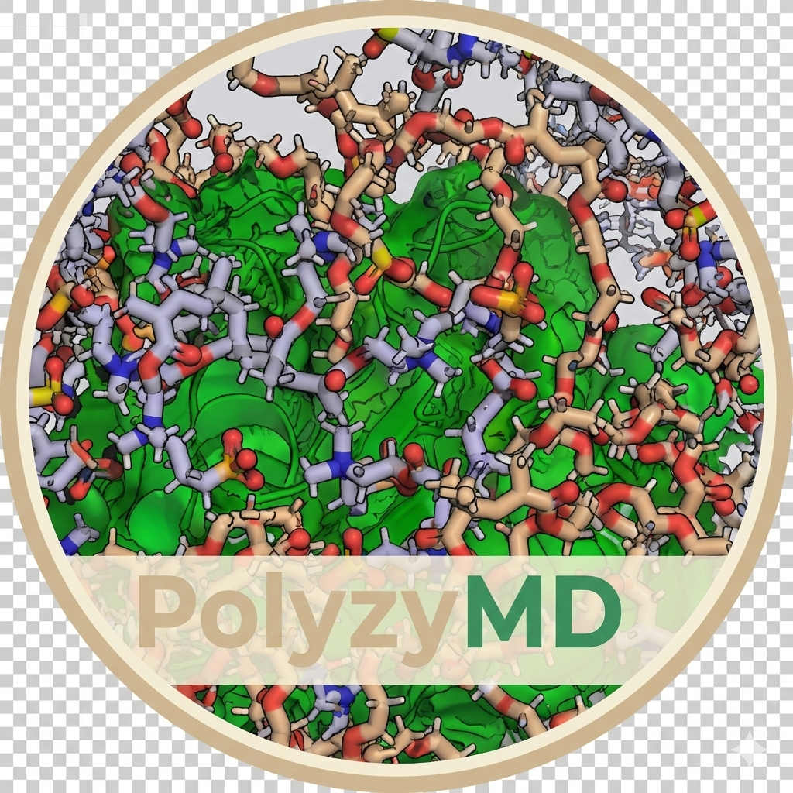

<p align="center">
  
</p>

<h1 align="center">PolyzyMD</h1>

<p align="center">
  <a href="https://github.com/joelaforet/polyzymd/actions/workflows/ci.yml"></a>
  <a href="https://www.python.org/downloads/"></a>
  <a href="https://opensource.org/licenses/MIT"></a>
</p>

<p align="center">
  <strong>Molecular dynamics simulation toolkit for enzyme-polymer systems.</strong>
</p>

<p align="center">
  <a href="https://polyzymd.readthedocs.io">Documentation</a> •
  <a href="#installation">Installation</a> •
  <a href="#quick-start">Quick Start</a>
</p>

---

## Overview

PolyzyMD provides a streamlined workflow for setting up and running MD simulations of enzymes with co-polymer chains. It handles:

- **System Building**: Combine enzyme structures, docked substrates, and random co-polymers
- **Solvation**: Add water, ions, and optional co-solvents with PACKMOL
- **Simulation**: Run equilibration and production with OpenMM
- **HPC Integration**: Self-resubmitting job submission for SLURM clusters
- **Configuration**: YAML-based configuration with validation

## Analysis Status

- Stable comparison and plotting workflows: RMSF, contacts, distances, catalytic triad, secondary structure, RMSD, Rg, SASA, and hydrogen bonds
- Experimental but still available: contacts binding preference
- Experimental features remain callable from the CLI, but PolyzyMD labels their text output and generated figures as experimental because definitions and interpretation may change in a later release
- Analysis supports both OpenMM (DCD) and GROMACS (XTC) trajectories via engine-aware trajectory resolution

## Installation

PolyzyMD uses [pixi](https://pixi.sh) for environment management. Pixi handles
all dependencies (OpenMM, OpenFF stack, CUDA, etc.) from conda-forge with
reproducible lockfiles.

### 1. Install pixi

```bash
curl -fsSL https://pixi.sh/install.sh | sh
```

### 2. Clone and install

```bash
git clone https://github.com/joelaforet/polyzymd.git
cd polyzymd
```

**For local use (building systems, validation, no GPU):**

```bash
pixi install -e build
pixi shell -e build
```

**For HPC clusters (GPU simulations):**

Pick the environment that matches your cluster's CUDA version:

| Cluster | CUDA | Environment | OpenMM |
|---------|------|-------------|--------|
| CU Boulder Blanca | 12.4 | `cuda-12-4` | 8.1 |
| PSC Bridges2 | 12.6 | `cuda-12-6` | 8.4 |

```bash
# Example for Blanca:
pixi install -e cuda-12-4
pixi shell -e cuda-12-4

# Example for Bridges2:
pixi install -e cuda-12-6
pixi shell -e cuda-12-6
```

After `pixi shell`, the `polyzymd` command is on PATH and works normally.

### How to find your CUDA version

Run on a GPU node:

```bash
nvidia-smi | head -1
```

The driver version in the top-right maps to a maximum supported CUDA version.
Use the environment whose CUDA version does not exceed your driver.

## Quick Start

### 1. Initialize a Project

```bash
polyzymd init --name my_simulation
cd my_simulation
```

This creates a project directory with a template `config.yaml` and placeholder files.

### 2. Add Your Structure Files

```bash
cp /path/to/enzyme.pdb structures/
cp /path/to/substrate.sdf structures/  # optional
```

### 3. Edit Configuration & Run

```bash
# Edit config.yaml with your settings, then:
polyzymd validate -c config.yaml
polyzymd submit -c config.yaml --replicates 1-5 --preset blanca-shirts
```

The `--preset` flag selects SLURM configuration and automatically picks the
correct pixi environment (`cuda-12-4` for Blanca, `cuda-12-6` for Bridges2).
You can override with `--pixi-env`:

```bash
polyzymd submit -c config.yaml --replicates 1-5 --preset bridges2 --pixi-env cuda-12-6
```

See the [Quick Start Guide](https://polyzymd.readthedocs.io/en/latest/tutorials/quickstart.html) for a complete walkthrough.

## CLI Commands

| Command | Description |
|---------|-------------|
| `polyzymd init -n my_project` | Initialize a new project directory |
| `polyzymd validate -c config.yaml` | Validate configuration file |
| `polyzymd build -c config.yaml` | Build simulation system |
| `polyzymd run -c config.yaml --engine gromacs` | Build and run GROMACS simulation |
| `polyzymd submit -c config.yaml` | Submit self-resubmitting jobs to SLURM |
| `polyzymd run-segment -c config.yaml` | Run a single production segment |
| `polyzymd check-progress -c config.yaml` | Check simulation completion status |
| `polyzymd recover -c config.yaml` | Resume a stalled simulation |
| `polyzymd info` | Show installation information |

## Pixi Environments

PolyzyMD uses [pixi](https://pixi.sh) instead of conda/mamba. Key differences:

- **No `conda activate`** — use `pixi shell -e <env>` instead
- **No environment YAML** — `pixi.toml` + `pixi.lock` are the single source of truth
- **Reproducible** — the lockfile pins every package to exact versions
- **CUDA-aware** — each environment pins the correct CUDA and OpenMM versions

| Environment | Use case | Requires GPU? |
|-------------|----------|---------------|
| `build` | System building, PDB prep, validation | No |
| `cuda-12-4` | Simulations on CUDA 12.4 clusters (Blanca) | Yes |
| `cuda-12-6` | Simulations on CUDA 12.6 clusters (Bridges2) | Yes |

### Adding support for a new cluster

1. Determine the CUDA version (`nvidia-smi` on a GPU node)
2. Add a new `[feature.cuda-X-Y]` block in `pixi.toml` following the existing pattern
3. Add the corresponding environment in `[environments]`
4. Add the preset mapping in `PRESET_DEFAULT_PIXI_ENV` in `slurm.py`
5. File a PR

## Documentation

Full documentation is available at **[polyzymd.readthedocs.io](https://polyzymd.readthedocs.io)**.

- [Installation Guide](https://polyzymd.readthedocs.io/en/latest/tutorials/installation.html)
- [Configuration Reference](https://polyzymd.readthedocs.io/en/latest/tutorials/configuration.html)
- [HPC & SLURM Guide](https://polyzymd.readthedocs.io/en/latest/tutorials/hpc_slurm.html)
- [API Reference](https://polyzymd.readthedocs.io/en/latest/api/overview.html)

## License

MIT License - see LICENSE file for details.

## Citation

If you use PolyzyMD in your research, please cite:

```bibtex
@software{polyzymd,
  author = {Laforet Jr., Joseph R.},
  title = {PolyzyMD: Polymer-Enzyme Interactions Studied with Molecular Dynamics},
  year = {2026},
  url = {https://github.com/joelaforet/polyzymd}
}
```
