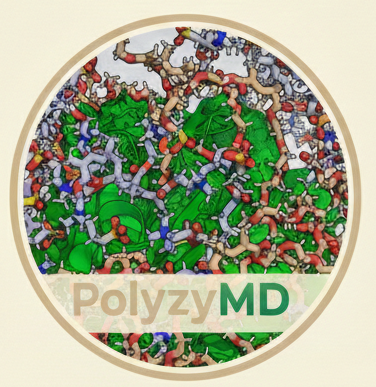

PolyzyMD Documentation
======================

**PolyzyMD** is a molecular dynamics simulation toolkit for studying enzyme-polymer systems.
It provides a streamlined workflow for setting up, running, and managing MD simulations
on HPC clusters.

.. note::
   PolyzyMD is under active development. If you encounter issues, please
   `open an issue <https://github.com/joelaforet/polyzymd/issues>`_ on GitHub.

Features
--------

- **YAML-based Configuration**: Define your entire simulation in a single, validated config file
- **Automated System Building**: Combine enzymes, substrates, polymers, and solvents
- **HPC Integration**: Daisy-chain job submission for SLURM clusters with automatic checkpointing
- **Flexible Restraints**: MDAnalysis-style atom selection for distance restraints
- **OpenFF/OpenMM Backend**: Modern force fields and GPU-accelerated simulations

Quick Example
-------------

.. code-block:: yaml

   name: "LipA_polymer_simulation"
   
   enzyme:
     name: "LipA"
     pdb_path: "structures/enzyme.pdb"
   
   polymers:
     enabled: true
     type_prefix: "SBMA-EGPMA"
     monomers:
       - label: "A"
         probability: 0.98
         name: "SBMA"
       - label: "B"
         probability: 0.02
         name: "EGPMA"
     length: 5
     count: 2
   
   simulation_phases:
     production:
       duration: 100.0  # ns
     segments: 10  # for HPC time limits

.. code-block:: bash

   # Validate and submit
   polyzymd validate -c config.yaml
   polyzymd submit -c config.yaml --replicates 1-5 --preset aa100

Getting Started
---------------

.. toctree::
   :maxdepth: 2
   :caption: Tutorials

   tutorials/installation
   tutorials/quickstart
   tutorials/cli_reference
   tutorials/configuration
   tutorials/equilibration
   tutorials/restraints
   tutorials/hpc_slurm
   tutorials/benchmarks
   tutorials/polymers
   tutorials/dynamic_polymers
   tutorials/gromacs_export
   tutorials/residue_assignment
   tutorials/architecture
   tutorials/packaging
   tutorials/troubleshooting
   tutorials/broken_molecules_debugging
   tutorials/contributing

Trajectory Analysis
-------------------

.. toctree::
   :maxdepth: 2
   :caption: Analysis Guide

   tutorials/analysis_rmsf_quickstart
   tutorials/analysis_rmsf_best_practices
   tutorials/analysis_reference_selection
   tutorials/analysis_compare_conditions
   tutorials/analysis_triad_quickstart
   tutorials/analysis_triad_best_practices

API Reference
-------------

.. toctree::
   :maxdepth: 2
   :caption: API Documentation

   api/overview
   api/config
   api/builders
   api/simulation
   api/workflow
   api/core

Indices and tables
==================

* :ref:`genindex`
* :ref:`modindex`
* :ref:`search`
