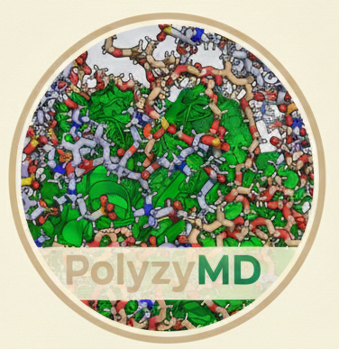

PolyzyMD Documentation
======================

PolyzyMD is a molecular dynamics toolkit for building, running, and analyzing
enzyme-polymer simulations.

Use this site by *need*:

- Start here if you need to install PolyzyMD or run a first simulation.
- Use Tutorials for guided, end-to-end learning.
- Use How-To Guides for specific tasks such as SLURM submission, restraints,
  polymers, GROMACS simulations, or condition comparisons.
- Use Reference for command lookup, configuration details, benchmarks, and API
  docs.
- Use Explanation for concepts, rationale, interpretation, and best practices.
- Use Contributor Guide for development architecture and extension workflows.

.. note::

   PolyzyMD is under active development. If you encounter issues, please
   `open an issue <https://github.com/joelaforet/polyzymd/issues>`_ on GitHub.

.. note::

   Stable analysis workflows for the `v1.3.0` release are RMSD, Rg, RMSF,
   contacts, distances, catalytic triad, secondary structure, SASA, and
   hydrogen bonds. RMSD analysis now includes automated convergence detection
   diagnostics. Binding preference, binding free energy, polymer affinity, and
   polymer bridging remain available, but are documented
   as experimental.

Choose Your Path
----------------

- :doc:`Get Started <get_started/index>`
  Install PolyzyMD with pixi and run your first simulation.
- :doc:`Tutorials <tutorials/index>`
  Follow guided, end-to-end workflows with clear success states.
- :doc:`How-To Guides <how_to/index>`
  Solve a specific task quickly without wading through background material.
- :doc:`Reference <reference/index>`
  Look up commands, config schema, API modules, and benchmark data.
- :doc:`Explanation <explanation/index>`
  Understand why workflows are structured the way they are and how to
  interpret results.
- :doc:`Contributor Guide <contributor_guide/index>`
  Extend PolyzyMD, understand the architecture, and contribute safely.

Common Workflows
----------------

- Install locally and validate the CLI:
  :doc:`Install PolyzyMD with pixi <tutorials/installation>`
- Build and submit a first simulation:
  :doc:`Run Your First PolyzyMD Simulation <tutorials/quickstart>`
- Run a comparison study across multiple conditions:
  :doc:`Compare Simulation Conditions <how_to/analysis_compare_conditions>`
- Generate comparison figures as a smoke test:
  :doc:`Analyze a Multi-Condition Study <tutorials/analysis_complete_workflow>`

.. IMAGE OPPORTUNITY: Add a single workflow schematic showing Build -> Submit ->
   Analyze -> Compare -> Plot, with stable and experimental analysis branches.
..

.. toctree::
   :hidden:
   :maxdepth: 2

   Get Started <get_started/index>
   Tutorials <tutorials/index>
   How-To Guides <how_to/index>
   Reference <reference/index>
   Explanation <explanation/index>
   Contributor Guide <contributor_guide/index>

Indices and Tables
==================

* :ref:`genindex`
* :ref:`modindex`
* :ref:`search`
